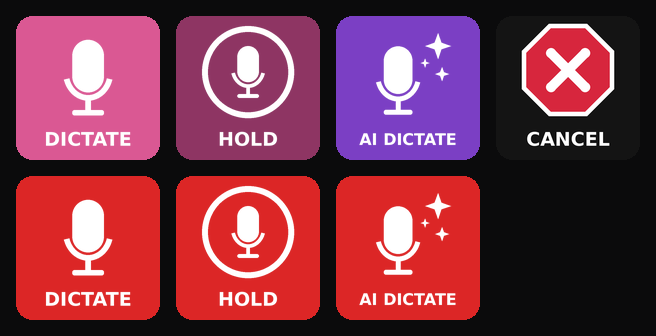

# Handy Deck

Stream Deck control for [Handy](https://github.com/cjpais/Handy) (offline speech-to-text) on macOS, through Bitfocus Companion or the native Stream Deck app.



`handy-ctl` signals the running Handy process directly: `SIGUSR2` for transcribe, `SIGUSR1` for transcribe with post-processing. Signals are instant and don't spawn a second app process. The script also tracks record state and pushes it to a Companion custom variable, so keys turn red while recording.

```
Stream Deck ─▶ Companion ─▶ handy-ctl ─▶ kill -USR2 <Handy pid>
                  ▲             │
                  └─ HTTP API ◀─┘  $(custom:handy_state) = idle | rec | ai
```

Unofficial companion tooling. Not affiliated with or endorsed by the Handy project.

---

## 1. Install

```bash
git clone https://github.com/codedre/handy-deck.git && cd handy-deck
zsh install.sh
```

The installer:
- installs `~/.local/bin/handy-ctl`
- writes `~/.config/handy-deck/config` on first run only
- builds `~/Applications/Handy Deck/` with three applets (for the native Stream Deck app) and the button icons
- runs `handy-ctl doctor`

Before continuing, set Handy to launch at login and make sure it already has Microphone and Accessibility permissions.

---

## 2. Companion (recommended)

### 2a. One-time setup

1. **Enable shell commands.** Companion 5.x ships with this off. In the Companion launcher window, click the **⚙ gear** (or the menu bar icon → **Advanced Settings**), open **Dangerous Features**, and turn on **Shell command support**. Companion restarts.
   - Headless alternative: `--enable-shell-command-support` or `COMPANION_ENABLE_SHELL_COMMAND_SUPPORT=1`.
   - Companion 4.x and earlier: shell commands are on by default; the action is named *Run shell path (local)*.
2. **Create the state variable.** Go to **Variables → Custom Variables** and add `handy_state` with startup value `idle`, persist off.
3. **Point the script at Companion's port.** The HTTP API is on by default. If Companion isn't on port 8000, edit `COMPANION_URL` in `~/.config/handy-deck/config`.
4. Run `handy-ctl doctor`. The companion line should read `OK`.

### 2b. Buttons

Every action is **Internal → System: Run shell command (local)** with timeout `2000`. Leave Working Directory and the result variable blank. `~` expands in Companion's shell.

| Key | Press | Release | Feedback (Internal → Variable: Check value) |
|---|---|---|---|
| **DICTATE** | `~/.local/bin/handy-ctl toggle` | none | `custom:handy_state` = `rec` → Background `#DC2626` |
| **HOLD** | `~/.local/bin/handy-ctl ptt-down` | `~/.local/bin/handy-ctl ptt-up` | `custom:handy_state` = `rec` → Background `#DC2626` |
| **AI DICTATE** | `~/.local/bin/handy-ctl ai` | none | `custom:handy_state` = `ai` → Background `#DC2626` |
| **CANCEL** | `~/.local/bin/handy-ctl cancel` | none | none |

Optional variants:
- A status tile with text `$(custom:handy_state)`.
- Push-to-talk with post-processing: `ptt-down ai` on press, `ptt-up` on release.

### 2c. Styling (Companion 5 layered styles)

1. Upload `icons/companion/*.png` in **Image Library → Import Images**.
2. On each key's **Style** tab, delete the default **Text** layer. Hiding it isn't enough, because hidden text still renders on the surface.
3. Add **+ → Image** and pick the matching library image. The glyphs have transparent backgrounds, so the Background layer shows through.
4. Set the **Background** color.

| Key | Image | Background |
|---|---|---|
| DICTATE | `handy-dictate` | `#DA5893` |
| HOLD | `handy-hold` | `#8E3563` |
| AI DICTATE | `handy-ai` | `#7B3FC4` |
| CANCEL | `handy-cancel-x` (full art) | `#141414` |

The feedback overrides only the Background color, so every dictation key turns the same red while recording.

Reference layout (example page):

| | Col 0 | Col 1 | Col 2 |
|---|---|---|---|
| **Row 0** | Home | DICTATE | HOLD |
| **Row 1** | · | AI DICTATE | CANCEL |

### 2d. Behavior

- **Toggle and AI:** each stops a recording with the same binding that started it, because Handy ignores a different binding while recording. Pressing AI during a plain recording stops the plain recording.
- **HOLD:** a tap shorter than `MIN_HOLD_MS` (250 ms) cancels instead of pasting. Press and release arriving out of order is handled (`RACE_WINDOW_MS`).
- **CANCEL:** discards the take, resets state to `idle`, and doubles as the resync button.
- **Handy not running:** any key launches it hidden in the background. Press again once it has loaded.

---

## 3. Native Stream Deck app (no Companion)

**Option A: applets.** These also update the state for Companion.
- Add **System → Open** pointing at `~/Applications/Handy Deck/Handy Toggle.app` (or `Handy AI Toggle`, or `Handy Cancel`).
- Set the key image from `~/Applications/Handy Deck/icons/streamdeck/`.
- The applets are agent apps (LSUIElement). Test with the cursor in a text field; if focus jumps, use Option B.

**Option B: Hotkey.** Zero focus risk, but no state tracking.
- In Handy → Settings, set the shortcut mode to **Toggle** and assign an unused combo, such as `⌃⌥⌘F13`.
- Add **System → Hotkey** in Stream Deck with the same combo.

Hold-to-talk needs Companion, because the native Hotkey action sends press and release together.

---

## 4. Test checklist

- [ ] `handy-ctl doctor`: all lines OK, and `executable: handy` is shown
- [ ] With the cursor in Notes, tap **DICTATE**: the key turns red and Handy's overlay shows (no window opens)
- [ ] Speak, then tap again: the key returns to pink and the text pastes
- [ ] Hold **HOLD** for 2 s while speaking, then release: the text pastes
- [ ] Quick-tap **HOLD**: nothing pastes and state is `idle`
- [ ] Tap **AI DICTATE**, speak, tap again: the key is red while recording and post-processed text pastes
- [ ] Tap **DICTATE**, then **CANCEL**: nothing pastes and state is `idle`

---

## 5. Reference

```
handy-ctl toggle | ai | ptt-down [ai] | ptt-up | cancel | reset | status | doctor
```

| Config key (`~/.config/handy-deck/config`) | Default | Purpose |
|---|---|---|
| `HANDY_APP` | detected | Path to Handy.app |
| `COMPANION_URL` | `http://127.0.0.1:8000` | Companion HTTP API; `""` disables push |
| `COMPANION_VAR` | `handy_state` | Custom variable name |
| `MIN_HOLD_MS` | `250` | PTT tap-to-cancel threshold |
| `RACE_WINDOW_MS` | `120` | Release this close to a press counts as the same tap |

The log is at `~/Library/Application Support/handy-deck/handy-ctl.log` and rotates at 1 MB.

## 6. Troubleshooting

| Symptom | Fix |
|---|---|
| Key does nothing, Companion says shell commands are disabled | Section 2a step 1, then restart Companion |
| Key opens the Handy window instead of recording | The pid lookup failed. Handy's binary is lowercase `handy`; current `handy-ctl` reads `CFBundleExecutable` and matches case-insensitively. Reinstall, then run `handy-ctl reset`. |
| Key color never changes | Run `handy-ctl doctor`. `404` means `handy_state` is missing; `000` means wrong port or Companion is down. |
| Key stuck red | Press **CANCEL** |
| Text on top of the icon | Delete the Text layer; hiding it isn't enough |
| Text pastes into the wrong window | Don't click the Companion web UI right before pressing; for native keys use Option B |
| Old clipboard pastes | Handy issue #502: Handy → Debug (`⌘⇧D`) → Reliable Paste |

## 7. Uninstall

```bash
zsh uninstall.sh          # keeps config
zsh uninstall.sh --purge  # removes config too
```

## Layout

```
bin/handy-ctl            controller (zsh)
install.sh / uninstall.sh
icons/companion/         transparent glyphs for Companion layered styles (+ full-art cancel)
icons/streamdeck/        baked idle/rec PNGs for the native Stream Deck app
icons/preview.png
```

## License

MIT. See [LICENSE](LICENSE).
